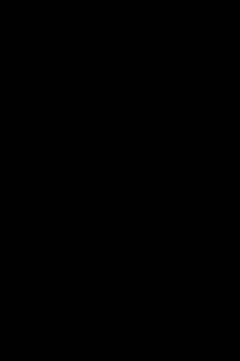

This software calculate the theoretical photoelastic image produced by an assembly of 3D spheres. The stress in the spheres is calculated from a finite element simulation (FEM) of linear elasticity (using [Fenicsx](https://fenicsproject.org/download/)), and the ray propagation is caculated. Aspects of note: 
- Input and output polariser can be changed on the fly. 
- Setup can be rotated to look at the photoelasticity under different angle (image needs to be recomputed, which can take time). 
- Colored photoelasticity is simulated using 3 different photoelastic constants for red, green, and blue.
- The Finite Element simulation is **displacement** controlled: ie. you need to specify a displacement corresponding to each contact, rather than a force. The displacement must be given in the global coordinate system, rather in the system of the contact (so not $\delta_n$ and $\delta_t$). 

## Install
1. Simplest is to start by installing [Miniconda](https://docs.anaconda.com/miniconda/install/)
2. Install [Fenicsx](https://fenicsproject.org/download/)
3. Install gmsh (in the appropriate conda environment) `conda install -c conda-forge gmsh python-gmsh`
4. Install SDL2: `sudo apt install libsdl2-dev`
5. Compile & build: `mkdir build && cd build`
6. `cmake ../src && make`

## Parameters
The configuration can be read from a json5 file directly provided on the commandline (`./photoelasticity config.json5`). The following key-values are recognised:

### Finite element parameters

- `mesh`: filename of the mesh to use for the FEM.
- `material`: object defining the material of the grains. Accepted key-values are:
  - `lambda`: First Lamé parameter
  - `mu`: Shear modulus (second Lamé parameter)

### Grain parameters

- `grains`: array of objects defining the grains. Each object contains the following:
  - `center`: center location for the grains (array with 3 elements)
  - `radius`: radius
  - `contacts`: array of objects defining the contacts. Each object contains:
    - `location`: point at which the force will be applied. More precisely, the force will be applied on the mesh point closest to that location. (array with 3 elements)
    - `displacement`: the displacement on the contact (array with 3 elements).

### Photoelasticity parameters

- `photoelastic constant`: 
  - Single number: constant for the monochrome photoelasticity
  - array of 3 numbers: constants for the reg, green, and blue wavelengths. 
  - arrya of 4 numbers: constants for the monochrome, red, green, and blue wavelengths, in that order. 
- `absorption`: double, default:0. absorbe the ray as well. Can be used to simulate X-ray for example. NOT IMPLEMENTED. 
- `color`: boolean, default: `false`. Indicates if the photoelasticity should be processed in RGB or with a single photoelastic value. 
- `pre-polarisation`: polarisation of the incident ray.
- `post-polarisation`: polariser for the ray just before hitting the detector. 

The polarisation can be given as a single number, corresponding to the angle from horizontal of the fast axis of a linear polariser, or one of the words "horizontal", "vertical", "right", "left", the latter two corresponding to circular polarisation. 

### Virtual detector parameters
The detector always points towards (0,0,0).

- `detector`: object defining the detector. Contains:
  - `image size: [width, height]`: size of the image to produce, in pixels.
  - `pixel size`: physical size of the pixels of the image (in distance unit).
  - `distance`: distance between the center and the detector.
  - `azimuth`: angle between the center of the detector and the x-axis.

### Display and calculation parameters

- `display size: [width, height]`: size of the display, in pixels. The displayed imahe is interpolated from the ray calculation on the image size.  
- `sampling`: integer, default:100. Sampling rate for the ray propagation. 
- `strategy`: modify the internal calculation performed by the software. The following are currently defined: 
  - LINEAR_NEARESTNEIGHBOUR: equidistant sampling along the ray within the grain, each point is allocated the stress in the "nearest" tetrahedron, calculated from the center of mass of the tetrahedron.
  - LINEAR_TETRAHEDRON_INVERSION: equidistant sampling along the ray within the grain, however the intersection with each tetrahedra within the ray are actually calculated, and the stress used at each point is the one from the tetrahedron it belongs to.
  - LINEAR_TETRAHEDRON_MOLLERTRUMBORE: same as previous, but the ray-tetrahedron intersection is calculated using the Möller Trumbore algorithm, rather than the matrix inversion (my own algo). 
  - TETRAHEDRON_EXPONENTIAL_INVERSION: the intersection with tetrahedra is calculated, and the polarisation transformation matrix is calculated from the actual matrix exponentiation, rather than repeated exponentiation as with the previous methods.
  - TETRAHEDRON_EXPONENTIAL_MOLLERTRUMBORE: same as previous, but the ray-tetrahedron intersection is calculated using the Möller Trumbore algorithm, rather than the matrix inversion (my own algo). 

## Interactive mode shortcuts
Several key shortcuts are defined in interactive mode to modify on the fly the displayed image:
- Setting the polarisation:
  - `SHIFT` with any of the following characters sets the polarisation of the incoming light. Without shift, sets the polariser added just before the detector.
  - `r` and `l`: right and left circular polarisation
  - `-`, `/`, `!`, `\`: linear polarisations at 0°, 45°, 90°, and -45°, respectively.
- `LEFT` and `RIGHT` arrows: rotate the source-detector around the object by +15° or -15°.
- `c`: toggle color mode.
